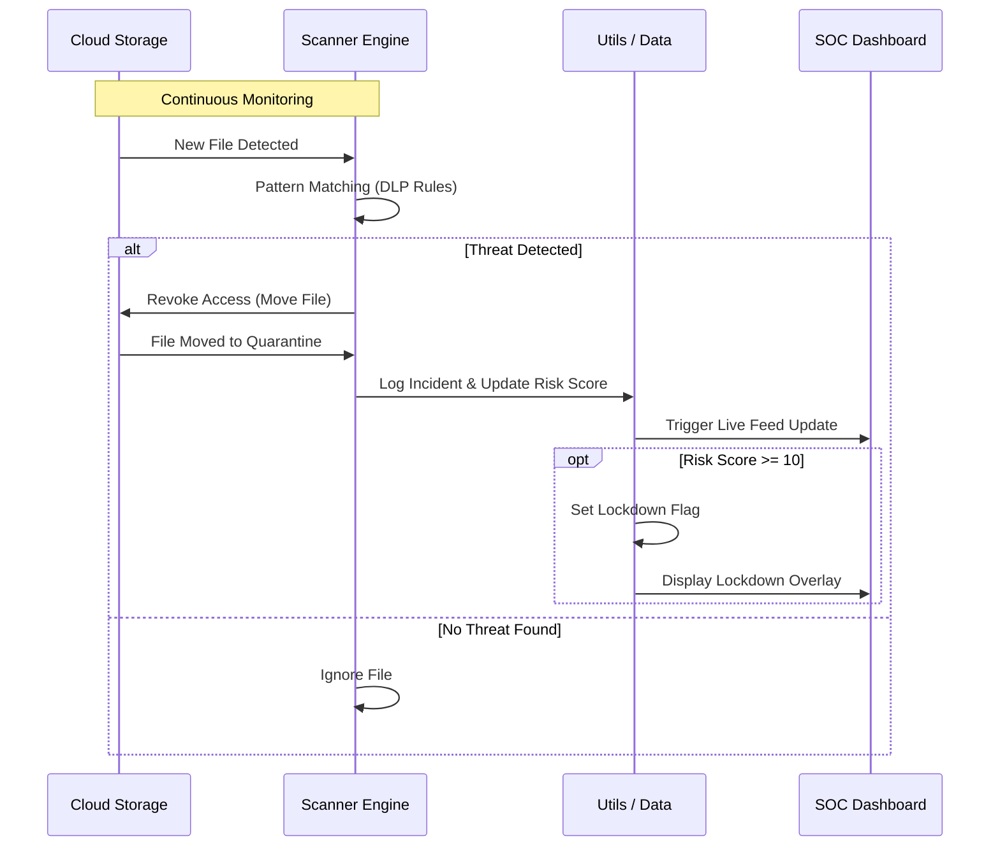
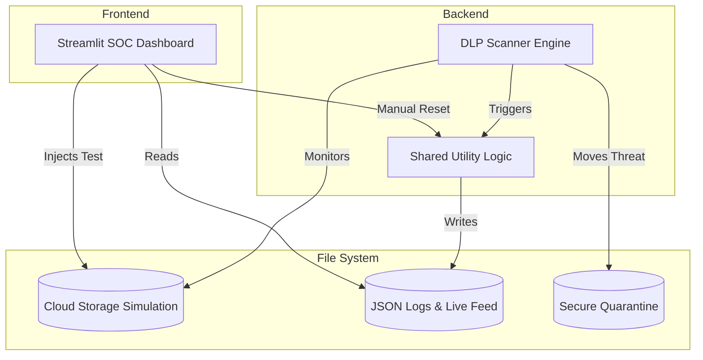

# Topic: The development and simulation of a Cloud Access Security Broker (CASB) focused on Data Loss Prevention (DLP) and Security Operations Center (SOC) management.

A real-time Cloud Access Security Broker (CASB) simulation that monitors cloud storage for sensitive data leaks (DLP), automates threat response, and provides a Live Security Operations Center (SOC) dashboard.

## 🚀 Overview

This project simulates how a CASB sits between users and cloud service providers to enforce security policies. It monitors a "Cloud" directory, detects PII (Personally Identifiable Information) like SSNs and Credit Card numbers, and automatically quarantines threats.

## 🔍 Key Features

-  Real-time DLP Scanner: Scans files for patterns (Regex) and moves compromised data to a secure quarantine folder.
               
- Live SOC Dashboard: Built with Streamlit to visualize risk levels, audit trails, and live activity feeds.

- Automated Response: Automatically triggers a System Lockdown if the threat velocity (Risk Score) exceeds a safety threshold.

- Audit Reporting: Generates downloadable PDF reports of all security incidents using fpdf2.

## 🛠️ Tech Stack 

- Language: Python 3.11+

- UI/Dashboard: Streamlit

- Data Analysis: Pandas

- Visualization: Plotly

- PDF Generation: FPDF2

## 🏛️ System Architecture Framework

The project utilizes a Decoupled Event-Driven Architecture, separating security enforcement from monitoring and management. This ensures that the security engine remains operational independently of the user interface.

Core Framework Layers

- Enforcement Layer (Scanner Engine): A background daemon that performs real-time file inspection. It operates on a Reactive Security Model, executing immediate remediation (Quarantine) upon pattern detection.

- Intelligence Layer (Shared Utilities): The central logic hub that manages global state. It handles Risk Heuristics, state persistence (Lockdown flags), and the transformation of raw JSON logs into formatted security reports.

- Presentation Layer (SOC Dashboard): A reactive web-based Control Plane that provides real-time telemetry. It interprets security data into visual metrics and allows administrative intervention (System Resets).

- Storage Layer (Simulated Infrastructure): A multi-tier directory structure that simulates the lifecycle of a cloud file—from initial upload (Cloud Storage) to detection and isolation (Quarantine).

Design Principles

- Persistence: Security states (Lockdowns) are stored on-disk, ensuring the system remains secure even after a reboot.

- Decoupling: The UI and Scanner operate in separate process environments to prevent performance bottlenecks.

- Zero-Trust Logic: Every file is treated as a potential threat until the scanner validates it against defined DLP rules.

### 🔄 Logical Data Flow

### 🌐 System Topology

## 🖥️ Dashboard Preview

## 🧪 How to Test

- Manual Leak: Drop a text file into cloud_storage containing SSN: 000-00-0000.

- Dashboard Simulation: Use the "Trigger Data Leak" button in the dashboard sidebar to inject threats automatically.

- Observation: Watch the file disappear from the cloud folder, move to quarantine, and appear in the Audit Log with an increased Risk Score.

- Lockdown: Inject 5+ threats rapidly to witness the Emergency Lockdown state.

## 📜 Security Policies (DLP Rules)

The system is currently configured to detect:

- US Social Security Numbers: \b\d{3}-\d{2}-\d{4}\b

- Credit Card Numbers: \b(?:\d{4}[ -]?){3}\d{4}\b

## 🛠️ Advanced Installation

Clone the Repository: https://github.com/MoriartyPuth/CASB-Security-Sentinel

Install Dependencies: pip install streamlit pandas plotly fpdf2 streamlit-autorefresh

## ⚠️ Disclaimer

This project is for educational and demonstrative purposes only. * Not Production Ready

